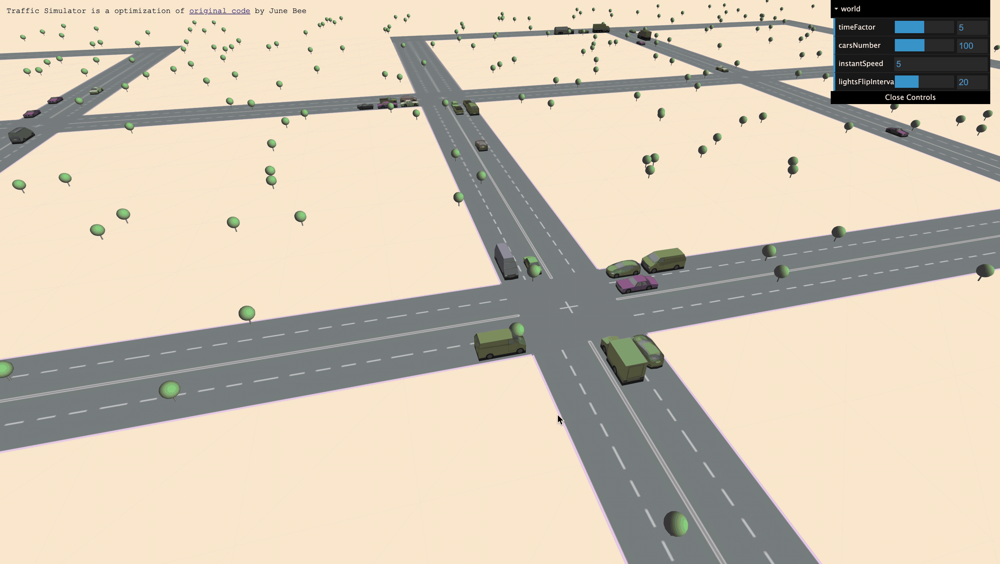
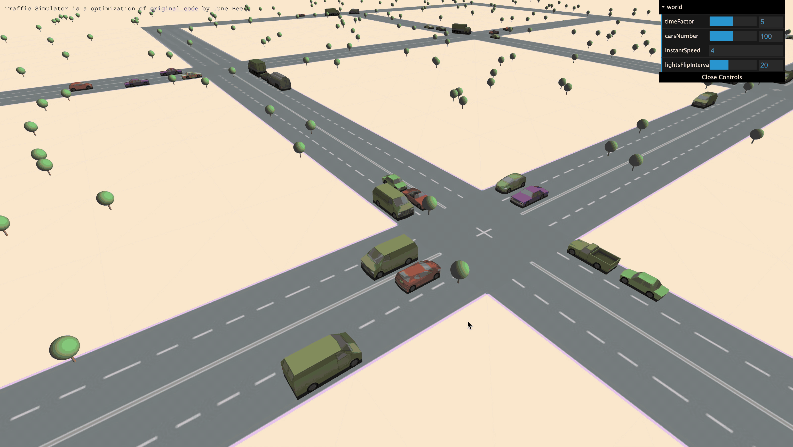

# Urabn Simulator Practices
This project is an extension of the practices explored in the “If City XR Urban Simulator.” It further investigates real-time traffic, population flow, and environmental interaction in a simulated urban environment, using interactive 3D visualization and procedural systems. For more information and related projects, please visit junesbee.com.
  

