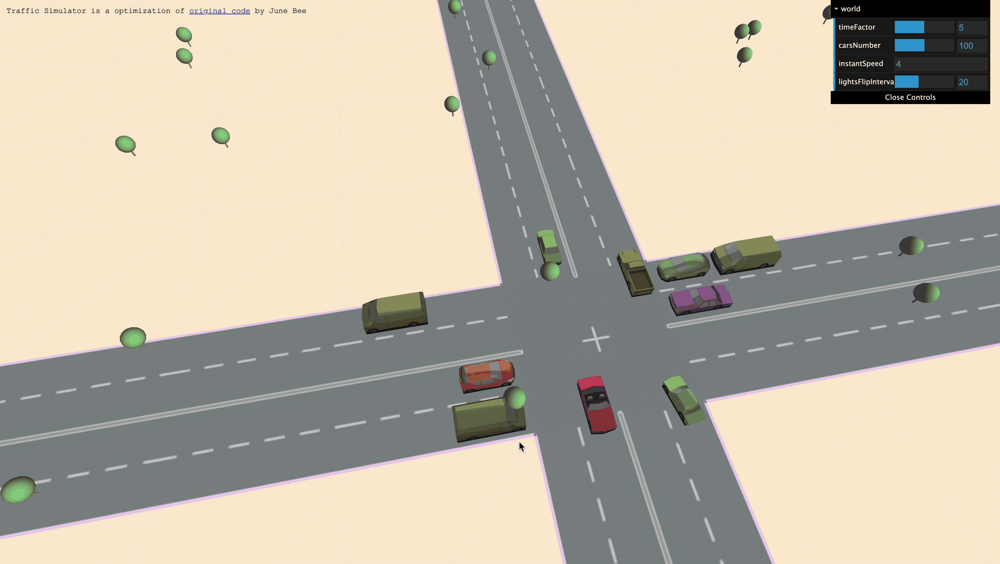

# Urabn Simulator Practices

This software allows users to see their usual content on moblie devices coming out into their reality with the three dimensional visual orientation. Without buying a 3D TV, purchasing 3D produced films, wearing VR headset, or only see augumented reality in certain apps. AVR filter is a lightweight algorithm on mobile screens that runs across all platforms to bring the internet world into the real life. 
